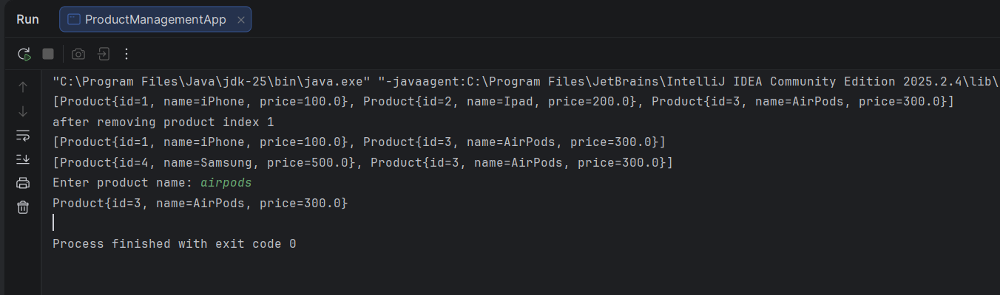
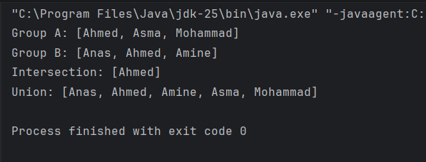
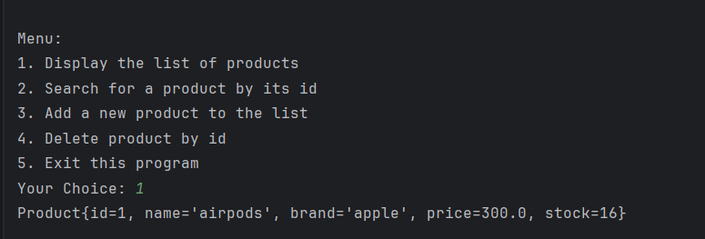
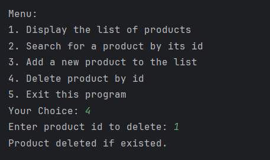
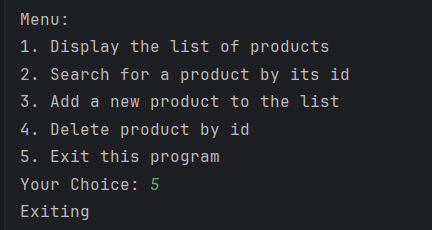

# TP4: Java Collections, Streams, and Generics

## Description
This project demonstrates the practical application of **Java Collections Framework** (Lists, Maps, Sets) and **Generics**. The solution is divided into two main parts: managing data structures using standard collections and creating custom generic classes and interfaces for flexible data management.

---

## Project Structure

The project is organized into the following packages and files based on the exercises:

### Part 1: Collections & Streams

#### 1. List Management (Products)
**File:** `TP4/ProductManagementApp.java` & `TP4/Product.java`
**Objective:** Manage a list of products using `ArrayList`.

* [cite_start]**Class `Product`:** Defines a product with attributes `id` (long), `name` (String), and `price` (double)[cite: 8].
* **App Functionality:**
    * [cite_start]**Add:** Adds new products to the list[cite: 11].
    * [cite_start]**Remove:** Deletes a product via its index[cite: 12].
    * [cite_start]**Display:** Prints the list of products[cite: 13].
    * [cite_start]**Modify:** Updates a product at a specific index[cite: 14].
    * [cite_start]**Search:** Finds a product by the name entered by the user[cite: 15].

* 

#### 2. Map Management (Student Grades)
**File:** `TP4/StudentsGrades.java`
**Objective:** Store and manipulate student grades using a `HashMap<String, Double>`.

* **Key Operations Implemented:**
    * [cite_start]**Insertion:** Adds student names (Key) and grades (Value)[cite: 17, 18].
    * [cite_start]**Modification:** Increases existing grades[cite: 19, 20].
    * [cite_start]**Deletion:** Removes a specific student's grade[cite: 21].
    * [cite_start]**Statistics:** Calculates and displays the size, average, maximum, and minimum grades[cite: 22, 23].
    * [cite_start]**Verification:** Checks if any student achieved a score of 20[cite: 24].
    * [cite_start]**Display:** Uses `forEach` with **Lambda expressions** to print the map content after operations[cite: 25].
* 
#### 3. Set Management (Student Groups)
**File:** `TP4/StudentGroups.java`
**Objective:** Perform set operations using `HashSet` on two groups of students (Group A and Group B).

* **Key Operations Implemented:**
    * [cite_start]**Populate:** Adds student names to `groupA` and `groupB`[cite: 31, 33].
    * [cite_start]**Intersection:** Displays names present in both groups (`retainAll`)[cite: 34].
    * [cite_start]**Union:** Displays all unique names from both groups (`addAll`)[cite: 35].
* 
---

### Part 2: Generics

#### 1. Generic Storage
**File:** `TP4/Generics/GenericStorage.java` & `TP4/Generics/Application.java`
**Objective:** Create a container class that can store elements of any type (`T`).

* **Class `GenericStorage<T>`:**
    * [cite_start]`addElement(T o)`: Adds an element to the internal list[cite: 44].
    * [cite_start]`removeElement(int index)`: Removes an element by position[cite: 45].
    * [cite_start]`getElement(int index)`: Retrieves an element by position[cite: 46].
    * [cite_start]`getSize()`: Returns the number of stored elements[cite: 48].
* [cite_start]**Test Application:** Verified with `Integer`, `String`, and `Double` types[cite: 50].
* 
#### 2. Generic Interface Implementation (Product Management)
**File:** `TP4/Generics/MetierProduitImpl.java` & `TP4/Generics/IMetier.java`
**Objective:** Implement a generic business interface for a specific `Product` entity.

* [cite_start]**Interface `IMetier<T>`:** Defines generic CRUD operations (`add`, `getAll`, `findById`, `delete`)[cite: 54, 55].
* [cite_start]**Class `Product` (Generics version):** Extended attributes including `id`, `name`, `brand`, `price`, `description`, and `stock`[cite: 53].
* [cite_start]**Implementation `MetierProduitImpl`:** Implements `IMetier<Product>` using an internal list[cite: 60].
* **Console Menu (`ProductApp.java`):**
    1.  [cite_start]Display list of products[cite: 63].
    2.  [cite_start]Search product by ID[cite: 64].
    3.  [cite_start]Add new product[cite: 65].
    4.  [cite_start]Delete product by ID[cite: 66].
    5.  [cite_start]Exit[cite: 67].
* 
* * 
* * 
* * * 
---

## How to Run
1.  Navigate to the project root directory.
2.  Compile the desired application file (e.g., `javac TP4/StudentsGrades.java`).
3.  Run the class file (e.g., `java TP4.StudentsGrades`).

4.  For the Generics exercise, navigate to the Generics package (e.g., `java TP4.Generics.ProductApp`).
